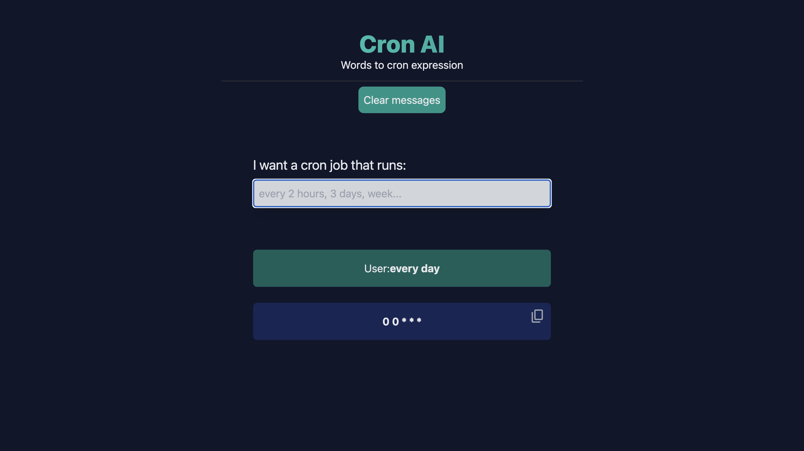

# Cron AI

This simple app converts natural language to cron expressions.

Final looks something like this rn:


## How to use

To run the example locally you need to:

1. Sign up at [OpenAI's Developer Platform](https://platform.openai.com/signup).
2. Go to [OpenAI's dashboard](https://platform.openai.com/account/api-keys) and create an API KEY.
3. Set the required OpenAI environment variable as the token value as shown [the example env file](./.env.example) but in a new file called `.env`.
4. `pnpm install` to install the required dependencies.
5. `pnpm dev` to launch the development server.

## Deploy to Vercel

This example can be directly deployed to Vercel, you can run the following commands:

```bash
pnpm run build
vercel deploy
```

This example is configured to use the `vercel-edge` [[Nitro preset](https://nitro.unjs.io/deploy/providers/vercel#vercel-edge-functions).
This means that the example will be deployed to Vercel's Edge Network.
You can use different providers, such as `vercel` by modifying your `nuxt.config.ts` file, or using the `NITRO_PRESET` environment variable.

## Learn More

To learn more about OpenAI, Nuxt, and the Vercel AI SDK take a look at the following resources:

- [Vercel AI SDK docs](https://sdk.vercel.ai/docs) - learn mode about the Vercel AI SDK
- [Vercel AI Playground](https://play.vercel.ai) - compare and tune 20+ AI models side-by-side
- [OpenAI Documentation](https://platform.openai.com/docs) - learn about OpenAI features and API.
- [Nuxt Documentation](https://nuxt.com/docs) - learn about Nuxt features and API
